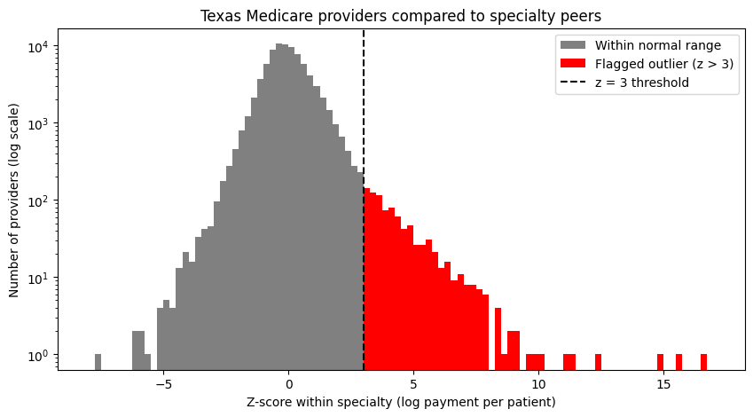

# Medpred: Medicare Billing Anomaly Detection (Texas, 2024)

## Question
Which Texas Medicare providers were paid unusually high amounts per patient compared to other providers in the same specialty?

## Data
- **Source:** CMS "Medicare Physician & Other Practitioners – by Provider" dataset from [data.cms.gov](https://data.cms.gov), 2024 data year
- **Filtered to:** individual providers (not organizations) in Texas, 82,081 providers total
- The data files aren't included in this repo because they're too large. You can download them from CMS (see "How to run it" below).

## Method
1. Filtered the national file to Texas individual providers and loaded it into a **SQLite** database.
2. Used **SQL** to explore the data: total payments by specialty, average payment per patient, and average services per patient.
3. Calculated **payment per patient** for each provider (total Medicare payments / number of Medicare patients).
4. Took the **log** of payment per patient, because payment data is very right-skewed and a few huge values would distort the averages.
5. Calculated a **z-score within each specialty**, so each provider is compared to peers who do similar work (a cardiologist to other cardiologists, not to podiatrists). I only included specialties with at least 30 providers so the averages are stable.
6. Flagged providers with **z > 3** (high side only, since the concern is overbilling).
7. Saved the results back into SQLite and used a **SQL JOIN** to see which specialties had the most outliers.

**Tools:** Python (pandas, NumPy, matplotlib), SQL (SQLite)

## Results
**887 of 81,895 providers (1.08%)** were flagged as outliers.

*Within-specialty z-scores for Texas providers (log scale). Red bars are the 887 flagged providers above z = 3.*

Most providers were close to their specialty's average, but there were more extreme high values than a normal bell curve would predict. With a normal distribution only about 0.13% would be above z = 3, so the flag rate was higher than expected. The most extreme provider had a z-score of about 16.7.

**Specialties with the most flagged providers:**

| Specialty | Providers | Flagged | % Flagged |
|---|---|---|---|
| Nurse Practitioner | 14,200 | 316 | 2.23 |
| Physician Assistant | 6,198 | 72 | 1.16 |
| Internal Medicine | 6,183 | 62 | 1.00 |
| Anesthesiology | 3,259 | 50 | 1.53 |
| Emergency Medicine | 3,447 | 46 | 1.33 |
| Family Practice | 6,385 | 45 | 0.70 |
| Diagnostic Radiology | 2,345 | 39 | 1.66 |
| Optometry | 2,428 | 35 | 1.44 |
| Neurology | 1,109 | 19 | 1.71 |
| General Surgery | 1,477 | 19 | 1.29 |

Nurse Practitioners had the most flags and the highest rate in this list. This is probably because NPs work in very different fields (primary care, oncology, dermatology, etc.), so comparing all NPs to each other isn't a perfect peer group. Five of the ten most extreme outliers were in Emergency Medicine.

## Limitations
- **An outlier is not proof of fraud.** A provider might be paid more per patient because they treat sicker patients, do more expensive procedures, or work in a subspecialty.
- **Specialty labels are broad**, so some peer groups mix providers who do very different work (like Nurse Practitioners).
- **The data didn't fully follow a bell curve**, so z > 3 should be treated as a screening cutoff, not an exact probability.
- The data only covers **one year** and **Medicare fee-for-service** patients, and CMS hides services with fewer than 11 patients for privacy.
- I didn't include provider names or NPIs of flagged providers here, since being an outlier doesn't mean someone did anything wrong.

## Next steps
- Adjust for how sick each provider's patients are using CMS's risk score (`Bene_Avg_Risk_Scre`)
- Use a robust z-score (based on the median) that's less affected by extreme values
- Check whether the same providers are flagged across multiple years
- Look at procedure-level data to see which billing codes drive each outlier

## How to run it
1. Download the 2024 "Medicare Physician & Other Practitioners – by Provider" CSV from data.cms.gov.
2. Filter it to `Rndrng_Prvdr_State_Abrvtn == "TX"` and `Rndrng_Prvdr_Ent_Cd == "I"`, and save it as `medicare_tx.csv` (the commented-out cell at the top of the notebook does this).
3. Open `Medpred.ipynb` in Google Colab, upload `medicare_tx.csv`, and run all cells.

## Files
- `Medpred.ipynb`: the full analysis (SQL queries, z-scores, and chart)
- `outlier_histogram.png`: the chart shown above

## Note
I built this project with help from Claude (an AI assistant), which I used as a tutor to learn SQLite and work through the
